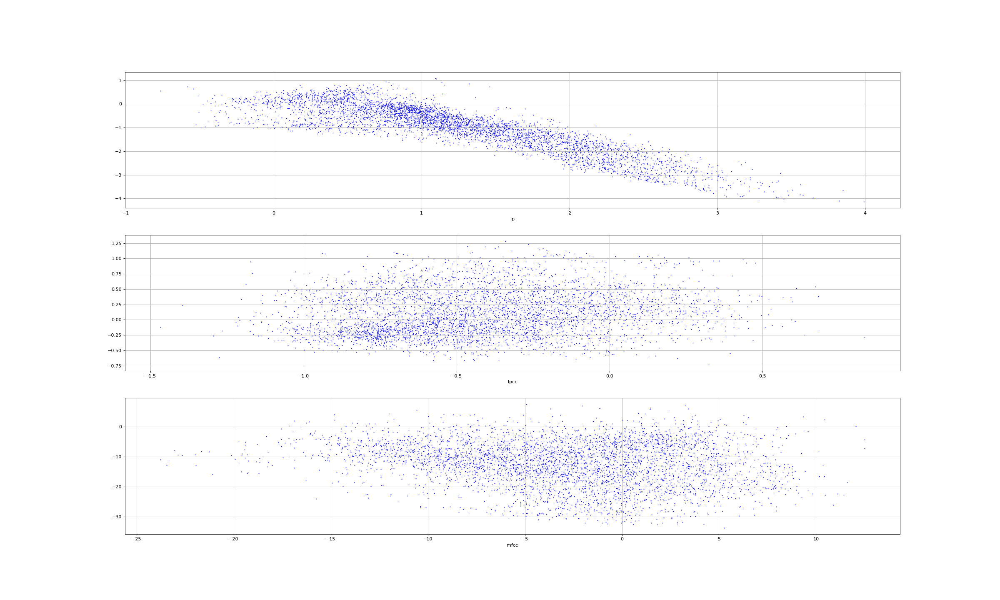
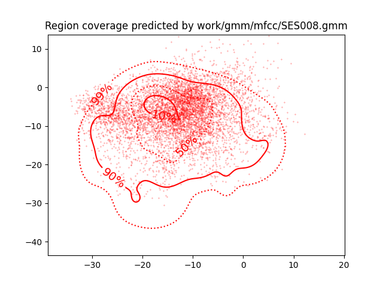

PAV - P4: reconocimiento y verificación del locutor
===================================================

Obtenga su copia del repositorio de la práctica accediendo a [Práctica 4](https://github.com/albino-pav/P4)
y pulsando sobre el botón `Fork` situado en la esquina superior derecha. A continuación, siga las
instrucciones de la [Práctica 2](https://github.com/albino-pav/P2) para crear una rama con el apellido de
los integrantes del grupo de prácticas, dar de alta al resto de integrantes como colaboradores del proyecto
y crear la copias locales del repositorio.

También debe descomprimir, en el directorio `PAV/P4`, el fichero [db_8mu.tgz](https://atenea.upc.edu/mod/resource/view.php?id=3654387?forcedownload=1)
con la base de datos oral que se utilizará en la parte experimental de la práctica.

Como entrega deberá realizar un *pull request* con el contenido de su copia del repositorio. Recuerde
que los ficheros entregados deberán estar en condiciones de ser ejecutados con sólo ejecutar:

~~~~~~~~~~~~~~~~~~~~~~~~~~~~~~~~~~~~~~~~~~~~~~~~~~~~~.sh
  make release
  run_spkid mfcc train test classerr verify verifyerr
~~~~~~~~~~~~~~~~~~~~~~~~~~~~~~~~~~~~~~~~~~~~~~~~~~~~~

Recuerde que, además de los trabajos indicados en esta parte básica, también deberá realizar un proyecto
de ampliación, del cual deberá subir una memoria explicativa a Atenea y los ficheros correspondientes al
repositorio de la práctica.

A modo de memoria de la parte básica, complete, en este mismo documento y usando el formato *markdown*, los
ejercicios indicados.

## Ejercicios.

### SPTK, Sox y los scripts de extracción de características.

- Analice el script `wav2lp.sh` y explique la misión de los distintos comandos involucrados en el *pipeline*
  principal (`sox`, `$X2X`, `$FRAME`, `$WINDOW` y `$LPC`). Explique el significado de cada una de las 
  opciones empleadas y de sus valores.

- Explique el procedimiento seguido para obtener un fichero de formato *fmatrix* a partir de los ficheros de
  salida de SPTK (líneas 45 a 51 del script `wav2lp.sh`).

  * ¿Por qué es más conveniente el formato *fmatrix* que el SPTK?

- Escriba el *pipeline* principal usado para calcular los coeficientes cepstrales de predicción lineal
  (LPCC) en su fichero <code>scripts/wav2lpcc.sh</code>:

- Escriba el *pipeline* principal usado para calcular los coeficientes cepstrales en escala Mel (MFCC) en su
  fichero <code>scripts/wav2mfcc.sh</code>:

### Extracción de características.

- Inserte una imagen mostrando la dependencia entre los coeficientes 2 y 3 de las tres parametrizaciones
  para todas las señales de un locutor.
  
  + Indique **todas** las órdenes necesarias para obtener las gráficas a partir de las señales 
    parametrizadas.
    
    Primero de todos debemos obtener ficheros txt con las tres parametrizaciones:
    ```zsh
      fmatrix_show work/lp/BLOCK01/SES017/*.lp | egrep '^\[' | cut -f4,5 > lpC2_3.txt

      fmatrix_show work/lpcc/BLOCK01/SES017/*.lpcc | egrep '^\[' | cut -f4,5 > lpccC2_3.txt

      fmatrix_show work/mfcc/BLOCK01/SES017/*.mfcc | egrep '^\[' | cut -f4,5 > mfccC2_3.txt
    ````
    Y luego con el siguiente script de python generamos las tres gráficas:

    ```python
      import numpy as np
      import matplotlib.pyplot as plt
      import os

      PATH = os.path.join(os.getcwd(), "Archivos")

      plt.figure(figsize=(30, 18), dpi=80)
      i = 311

      for file in sorted(os.listdir(PATH)):                                        
        if file.endswith(".txt"):
          plt.subplot(i)
          file_dir = os.path.join(PATH, file)
          data = np.loadtxt(file_dir)
          plt.scatter(data[:,0], data[:,1], s=0.5, color = 'red')
          plt.xlabel(file[:-8])
          plt.grid()
          i += 1

      plt.savefig("grafica.png") 
      plt.show()
    ```
  + ¿Cuál de ellas le parece que contiene más información?
    
    Cuando hablamos de información nos referimos nos referimos a la incorrelación entre sus coeficientes.
    Observando los coeficientes obtenidos por la parametrización LP, podemos ver como siguen una tendencia lineal, y con una dispersión menor que en las otras dos parametrizaciones.
    En el caso de la parametrización LPCC ya no se aprecia esa distribución lineal que comentabamos del LP, y su distribución es más dispersa por lo que sus coeficientes estan más incorrelados, por consiguiente contiene más información.
    Finalmente, podemos ver como la que contiene mayor dipsersión de todas es la MFCC, con lo que es la que contiene myor información.

- Usando el programa <code>pearson</code>, obtenga los coeficientes de correlación normalizada entre los
  parámetros 2 y 3 para un locutor, y rellene la tabla siguiente con los valores obtenidos.

  |                        | LP   | LPCC | MFCC |
  |------------------------|:----:|:----:|:----:|
  | &rho;<sub>x</sub>[2,3] |  -0.872284    |  0.150782    |  -0.187225    |
  
  + Compare los resultados de <code>pearson</code> con los obtenidos gráficamente.
    Podemos ver lo que comentabamos en el apartado anterior como la parametrización LP aporta poc información mientras que la que nos aporta más es la LPCC.
  
- Según la teoría, ¿qué parámetros considera adecuados para el cálculo de los coeficientes LPCC y MFCC?
  Según hemos estudiado en teoria, para os mfcc con un orden 30 seria más que suficiente, y pa los LPCC según la libreria SPTK con 25 coeficientes.

### Entrenamiento y visualización de los GMM.

Complete el código necesario para entrenar modelos GMM.

- Inserte una gráfica que muestre la función de densidad de probabilidad modelada por el GMM de un locutor
  para sus dos primeros coeficientes de MFCC.
  
  Para la siguiente función de densidad hemos usado el locutor SES007, el comando introducido ha sido:
  ```zsh
    plot_gmm_feat -x1 -y2 -p 99,90,50,10 work/gmm/mfcc/SES008.gmm work/mfcc/BLOCK00/SES007/SA007S*
  ```
  

- Inserte una gráfica que permita comparar los modelos y poblaciones de dos locutores distintos (la gŕafica
  de la página 20 del enunciado puede servirle de referencia del resultado deseado). Analice la capacidad
  del modelado GMM para diferenciar las señales de uno y otro.

### Reconocimiento del locutor.

Complete el código necesario para realizar reconociminto del locutor y optimice sus parámetros.

- Inserte una tabla con la tasa de error obtenida en el reconocimiento de los locutores de la base de datos
  SPEECON usando su mejor sistema de reconocimiento para los parámetros LP, LPCC y MFCC.

### Verificación del locutor.

Complete el código necesario para realizar verificación del locutor y optimice sus parámetros.

- Inserte una tabla con el *score* obtenido con su mejor sistema de verificación del locutor en la tarea
  de verificación de SPEECON. La tabla debe incluir el umbral óptimo, el número de falsas alarmas y de
  pérdidas, y el score obtenido usando la parametrización que mejor resultado le hubiera dado en la tarea
  de reconocimiento.
 
### Test final

- Adjunte, en el repositorio de la práctica, los ficheros `class_test.log` y `verif_test.log` 
  correspondientes a la evaluación *ciega* final.

### Trabajo de ampliación.

- Recuerde enviar a Atenea un fichero en formato zip o tgz con la memoria (en formato PDF) con el trabajo 
  realizado como ampliación, así como los ficheros `class_ampl.log` y/o `verif_ampl.log`, obtenidos como 
  resultado del mismo.
